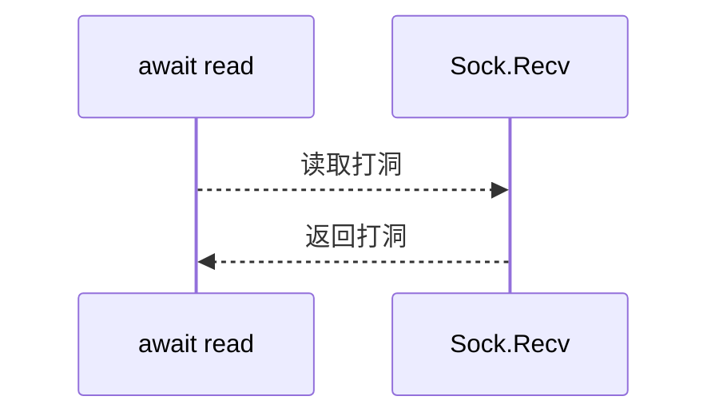
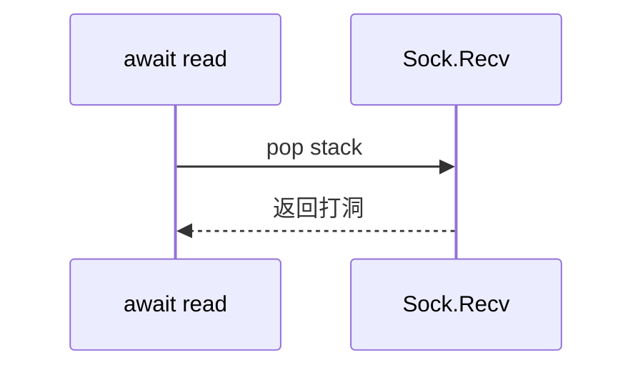

# ZYSOCKET 第5代异构框架(ZYSOCKET-V)

## 使用方式:
NUGET:

[Server link description here](https://www.nuget.org/packages/ZYSocketServerV)

    Server: PM> Install-Package ZYSocketServerV
[Client link description here](https://www.nuget.org/packages/ZYSocketClientV)

    Client: PM> Install-Package ZYSocketClientV

## 介绍:

**构架:**
采用PopStack的PIPE Read 模式,例如 读取 一个字符串

     var str=await fiberRw.ReadString(); 
     var value=await fiberRw.Readint32();
 
你不需要知道数据包缓冲好了没,读到了没,当它准确读取到这段数据后,线程会返回继续处理你的逻辑.
你可能会想到  PIPE OR  Coroutine

Pipe modes: 他是双向打洞模式

ZYV modes:是单项打洞模式,读取的时候是弹出栈到Socket层,Socket读取到数据后使用PIPE返回当前的内容上下文继续运行.内部采用异步Stream模式.方便支持各种流载体比如SSLStream,TlsStream,GzipStream..

以前的ZYSOCKET框架采用了 A B模式,当Recv到数据包的时候,读取长度压入缓冲区.最后待数据包完整后,返回完整的数据包.注意这里有个 数据包缓冲区,所以你需要COPY 一次BYTE[] AND 重新Read 并且 New BYTE[]数据包.而且数据包缓冲区占用了一定的内存.这样的套路优点在于简单,稳定性好.缺点在于 性能无法发挥到极致.因为有GC,所以拖累了CPU,应为有缓冲区,所以拖累了内存. 

当然也有做的好的,比如IKende的BX,采用数据链,绑定到SOCKET上. 我称他为A B C模式. 当RECV到数据先写入到数据链表(B)中,SOCKET(A) 始终在写你的下一个或者下下个数据链表项,让你(C)感觉你再读一条数据长链. 这样的好处在于,你可以减少一次COPY. 但是缺点也很明显你需要维护一个很长的数据链表.CPU不敢说,但是内存是绝对需要很大的量来维持数据链表的. 而且你还需要一个线程池来平衡A端和C端.当然如果用上SSL 协议.那么这套逻辑的唯一GET点在于可以方便的嵌套SSLStream.不过BX是一款非常优秀的SOCKET框架.除了内存高了点外,(这没办法设计模式).

**性能方面:**
CPU 性能方面是非常高的.你不要看到它使用了await 就认为他性能不行了,为啥因为await生成了其他的代码.其实那点代码可以略微不计.总体性能可以保证不低于 或者 非常接近 C++ OR GOLANG 编写的主流SOCKET 框架.
内存方面: 除了基本运行内存 (一般来说.NET CORE 程序大概是10M左右).连接数X你缓冲区的 内存大小了. 比如你每个链接4K.那么设置1W链接就是39MB. 你也许会问.为什么你要先创建.不会动态分配吗?那样更少,虽然延迟创建固然好,但是节省了内存,换来的是你在那刹那增加的CPU.和不稳定性.
GC方面:
因为使用了PIPE,所以缓冲区我们基本就没有了,但是 如果你需要直接ReadBytes() 返回一个BYTE[] 数组的时候怎么办呢?这个真没办法,如果你需要返回一个BYTE[],那只能NEW.但是你如果需要读取一个Memory<Byte> or SPAN<Byte> 我采用了 MemoryPool 的方式在内存池里给你分配一段大小适中的内存. 然后将数据COPY到这块内存中,供你使用. 这样就可以避免GC了. 当然用完记得释放它.而且你也可以将它转换成BYTE[]使用,记住INDEX LEN 简单的方法:

       using (var p8 = await fiberRw.ReadMemory())
             {
                    var mem = p8.Value.GetArray();
                    byte[] data = mem.Array;
                    int index = mem.Offset;
                    int len = mem.Count;
                    .......
             }

使用了.NET STD 2发布. 没办法为了支持所有的.NET支持的平台,舍弃了很多.NET CORE的新功能.可是使用的平台包括 .NET FX; .NETCORE; MONO;. XAMARIM IOS;XARMARIM ANDROID. (注意如果是IOS系统请使用[Portable]版,因为IOS AOT禁用EMIT,所以只是PROTOBUFF.NET 使用了一个没有EMIT的版本.

支持stream嵌套操作,比如SSLStream GzipStream,详细可以看DEMO.

## 关于如何使用:
我目前提供了一个DEMO的多种版本供参考[DEMO URL](https://github.com/luyikk/ZYSOCKET-V/tree/master/Demo)

## **注意事项:**
本框架对于一个连接来说,在相同时间里,只有一个线程在处理它.不是在SOCKET RECV,就是在处理await Read. 这样设计有个好处在于,1 你不需要QUEUE,2 对于当前连接来说,它的所有资源你都无需LOCK, 但是也有坏处 所以如果逻辑上对于这个线程堵塞了.那么就会降低性能. 例如同步读取数据库.同步GET一个URL.等.
那么如何处理呢. 当你读取到基本数据,处理完基本逻辑时. 需要处理复杂逻辑,你就需要  call async void method 什么意思呢.下面来个代码示范.

            static async ValueTask DataOnByLine(IFiberRw<string> fiberRw)
            {
                var cmd = await fiberRw.ReadInt32();
                var p1 = await fiberRw.ReadInt32();
                var p2 = await fiberRw.ReadInt64();
                ReadData(cmd, p1, p2);
            }
    
            static async void ReadData(int cmd,int p1,long p2)
            {
                try
                {
                   //运行逻辑
                    var data = await DataBase.Select("select * from table"); //调用数据库是非常久的.
                  // 使用回调线程继续运行逻辑
                }
                catch(Exception er)
                {
                    Log.Error(er);
                }
            }

**注意上面的 static async void ReadData,以及try catch,因为如果这里的异常 你根本无法外面捕捉,所以需要加一个try catch捕捉异常,否则异常的话将导致服务器崩溃.**

最后测试结果 linux 64 I7 8700K 输出可达80W QPS
